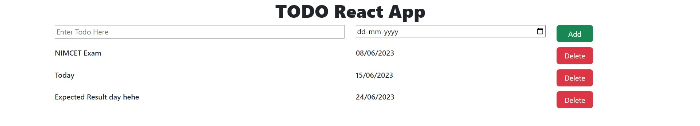

# Todo-React-App

A simple and efficient to-do list application built using React and Vite.

## Features

- Add, edit, and delete tasks.
- Mark tasks as complete.
- Responsive design for optimal use on various devices.



## Installation

To install and run the project locally:

1. Clone the repository:
   ```sh
   git clone https://github.com/NamanSoni18/Todo-React-App.git


2. Navigate to the project directory:
   ```sh
   cd Todo-React-App


3. Install the dependencies:
   ```sh
   npm install

4. Start the development server:
   ```sh
   npm run dev

Usage
Open your browser and navigate to http://localhost:5173 to use the calculator.

Technologies Used
- React
- CSS
- Bootstrap


Contributing
Contributions are welcome! Please fork the repository and submit a pull request.
